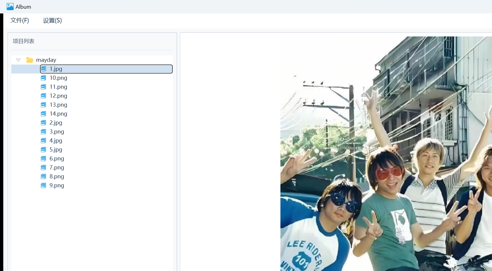

# Album - Qt 相册管理器

一个基于 **Qt 6 / C++11** 开发的桌面相册管理应用，支持项目管理、图片浏览、幻灯片播放（带动画与背景音乐）等功能。采用 MVC 架构，多线程文件扫描，自定义控件与 QSS 样式表实现现代化 UI。

## 功能特性

- **项目管理** — 通过向导创建新项目（自动复制图片到项目目录）或打开已有文件夹，以树形结构组织图片资源
- **图片浏览** — 双击树节点查看图片，支持上一张/下一张切换，鼠标悬停显示导航按钮（带淡入淡出动画）
- **幻灯片播放** — 全屏幻灯片模式，图片切换带渐变动画效果，支持播放/暂停控制
- **背景音乐** — 幻灯片播放时支持背景音乐，内置播放列表管理（`QMediaPlayer`）
- **缩略图预览列表** — 幻灯片底部显示已浏览图片的缩略图列表，可快速跳转
- **多线程扫描** — 文件递归扫描与复制在子线程执行，主线程通过信号槽更新进度条，界面不卡顿
- **自定义控件** — 状态按钮（Normal/Hover/Pressed 六态切换）、动画绘制控件等
- **QSS 样式表** — 统一的扁平化现代 UI 风格

## 演示截图

### 图片浏览

<p align="center">
  
  <br>
  <em>打开 mayday 项目后，左侧项目树展示所有图片，双击 1.jpg 在右侧浏览</em>
</p>

## 技术栈

| 类别 | 技术 |
|------|------|
| 语言 | C++11 |
| 框架 | Qt 6 (core, gui, widgets, multimedia) |
| 构建系统 | qmake |
| 样式 | QSS (Qt Style Sheets) |
| 多线程 | QThread + 信号槽 / std::thread |
| 音频 | QMediaPlayer + QAudioOutput |
| 动画 | QPropertyAnimation + QGraphicsOpacityEffect / QTimer 自绘 |

## 架构设计

项目采用 **MVC（Model-View-Controller）** 架构：

```
┌──────────────────────── MainWindow (主窗口) ────────────────────────┐
│  菜单栏: 文件(创建/打开项目)  设置(背景音乐)                          │
│  ┌────────────────┐  ┌─────────────────────────────────────────┐   │
│  │   ProTree      │  │            PicShow (图片展示)            │   │
│  │  (项目树容器)   │  │   QLabel + 上一张/下一张(悬停动画)        │   │
│  │  ┌───────────┐ │  └─────────────────────────────────────────┘   │
│  │  │TreeWidget│ │                                                 │
│  │  │ 项目节点  │ │  信号槽连接:                                     │
│  │  │ 文件夹    │ │   SigUpdateSelected → PicShow::SlotSelectItem  │
│  │  │ 图片节点  │ │   SigPre/SigNext → ProTreeWidget::SlotPre/Next │
│  │  └───────────┘ │                                                 │
│  └────────────────┘                                                 │
├────────────────────────────────────────────────────────────────────-┤
│                        数据层 (Model)                               │
│  ┌──────────────┐  ┌──────────────┐  ┌──────────────────────────┐  │
│  │ ProTreeItem  │  │ProTreeThread │  │    SlideShowDlg          │  │
│  │ (树节点+链表) │  │(扫描复制线程)│  │   (幻灯片+动画+音乐)     │  │
│  └──────────────┘  └──────────────┘  └──────────────────────────┘  │
│  ┌──────────────┐  ┌──────────────┐  ┌──────────────────────────┐  │
│  │OpenTreeThread│  │PicAnimationWid│  │     PreListWid           │  │
│  │(打开项目线程) │  │ (渐变动画)   │  │   (缩略图预览列表)        │  │
│  └──────────────┘  └──────────────┘  └──────────────────────────┘  │
└────────────────────────────────────────────────────────────────────-┘
```

### 核心组件说明

| 组件 | 职责 |
|------|------|
| `MainWindow` | 主窗口，菜单栏、工具栏、整体布局管理 |
| `Wizard` / `ProSetPage` / `ConfirmPage` | 项目创建向导，收集项目名称与路径 |
| `ProTree` / `ProTreeWidget` | 项目树容器与自定义树控件，管理右键菜单、导入、幻灯片等 |
| `ProTreeItem` | 自定义树节点，存储文件路径及前后节点指针（双向链表实现上一张/下一张） |
| `ProTreeThread` | 文件扫描与复制线程，递归遍历源目录并复制到项目目录 |
| `OpenTreeThread` | 打开已有项目线程，递归扫描目录构建树结构 |
| `PicShow` | 图片展示窗口，支持前后翻页与悬停按钮动画 |
| `SlideShowDlg` | 幻灯片播放对话框 |
| `PicAnimationWid` | 幻灯片渐变动画控件，`QTimer` 驱动 `paintEvent` 实现交叉淡入淡出 |
| `PreListWid` / `PreListItem` | 缩略图预览列表，记录已浏览图片 |
| `PicButton` / `PicStateBtn` | 自定义按钮控件，支持多状态图标切换 |

## 项目结构

```
album/
├── album.pro                 # qmake 工程文件
├── main.cpp                  # 程序入口
├── mainwindow.cpp/h          # 主窗口
├── const.h                   # 全局常量与枚举定义
├── wizard.cpp/h              # 项目创建向导
├── prosetpage.cpp/h/ui       # 向导-项目设置页
├── confirmpage.cpp/h/ui      # 向导-确认页
├── protree.cpp/h/ui          # 项目树容器
├── protreewidget.cpp/h       # 自定义树控件 (核心)
├── protreeitem.cpp/h         # 自定义树节点 (数据模型)
├── protreethread.cpp/h       # 文件扫描复制线程
├── opentreethread.cpp/h      # 打开项目线程
├── picshow.cpp/h/ui          # 图片展示窗口
├── slideshowdlg.cpp/h/ui     # 幻灯片播放对话框
├── picanimationwid.cpp/h     # 渐变动画控件
├── prelistwid.cpp/h          # 缩略图预览列表
├── prelistitem.cpp/h         # 预览列表项
├── picbutton.cpp/h           # 自定义图片按钮
├── picstatebtn.cpp/h         # 多状态按钮 (播放/暂停)
├── removeprodialog.cpp/h/ui  # 删除项目对话框
├── rc.qrc                     # Qt 资源文件
├── style/
│   └── style.qss             # QSS 样式表
├── icon/                      # 图标资源 (28 个)
├── music/                     # 背景音乐
├── album/                     # 示例图片
├── screenshots/               # 演示截图
│   └── album_with_photos.png  # 程序运行截图（mayday 素材）
└── convert_to_docx.py         # 辅助工具: Markdown 转 Word
```

## 构建与运行

### 环境要求

- **Qt 6.x**（需包含 `core`, `gui`, `widgets`, `multimedia` 模块）
- **MinGW 64-bit** 或 **MSVC** 编译器
- **Qt Creator**（推荐）

### 构建步骤

1. **克隆仓库**

   ```bash
   git clone https://github.com/<your-username>/album.git
   cd album
   ```

2. **使用 Qt Creator 打开**

   - 打开 Qt Creator → File → Open File or Project
   - 选择 `album.pro`
   - 配置 Kit（如 Desktop Qt 6.x MinGW 64-bit）
   - 点击 **Run** (Ctrl+R) 编译并运行

3. **或使用命令行构建**

   ```bash
   qmake album.pro
   make        # 或 mingw32-make
   ```

## 使用说明

### 创建项目

1. 菜单栏 **文件 → 创建项目**（或 `Ctrl+N`）
2. 在向导中输入项目名称并选择存储路径
3. 选择要导入的图片文件夹
4. 等待文件扫描复制完成（进度条显示进度，可取消）

### 打开项目

1. 菜单栏 **文件 → 打开项目**（或 `Ctrl+O`）
2. 选择已有的项目文件夹
3. 等待扫描完成

### 浏览图片

- 双击树中的图片节点即可在右侧展示
- 鼠标移到图片左右两侧会出现 **上一张/下一张** 按钮
- 右键项目节点可选择 **导入**、**设为活动项目**、**关闭项目**、**幻灯片播放**

### 幻灯片播放

- 右键项目节点 → **幻灯片播放**
- 图片自动切换，带渐变动画效果
- 底部缩略图列表显示已浏览的图片
- 可点击 **播放/暂停** 按钮控制

### 背景音乐

- 菜单栏 **设置 → 背景音乐**（或 `Ctrl+M`）
- 选择音乐文件后，幻灯片播放时自动播放背景音乐

## 技术亮点

### 1. 多线程文件扫描

文件递归扫描在 `QThread` 子线程中执行，通过信号槽机制通知主线程更新进度条，避免 UI 冻结：

```cpp
// 子线程扫描并发射信号
emit SigUpdateProgress(file_count);

// 主线程槽函数更新进度条
void ProTreeWidget::SlotUpdateProgress(int count) {
    _dialog_progress->setValue(count % PROGRESS_MAX);
}
```

### 2. 双向链表实现图片导航

`ProTreeItem` 继承 `QTreeWidgetItem`，增加前后节点指针，实现 O(1) 的上一张/下一张切换：

```cpp
class ProTreeItem : public QTreeWidgetItem {
    QTreeWidgetItem* _pre_item;
    QTreeWidgetItem* _next_item;
    // GetPreItem() / GetNextItem() / GetFirstPicChild() / GetLastPicChild()
};
```

### 3. 自定义渐变动画

`PicAnimationWid` 通过 `QTimer` 驱动 `paintEvent`，在两张图片之间做 alpha 混合实现交叉淡入淡出：

```cpp
void PicAnimationWid::TimeOut() {
    _factor += 0.02;
    if (_factor >= 1.0) { _factor = 0; /* 切换图片 */ }
    update(); // 触发重绘
}
```

### 4. 信号槽跨线程通信

子线程只负责计算与发信号，所有 UI 操作在主线程槽函数中完成，保证线程安全。

## License

本项目仅供学习交流使用。
